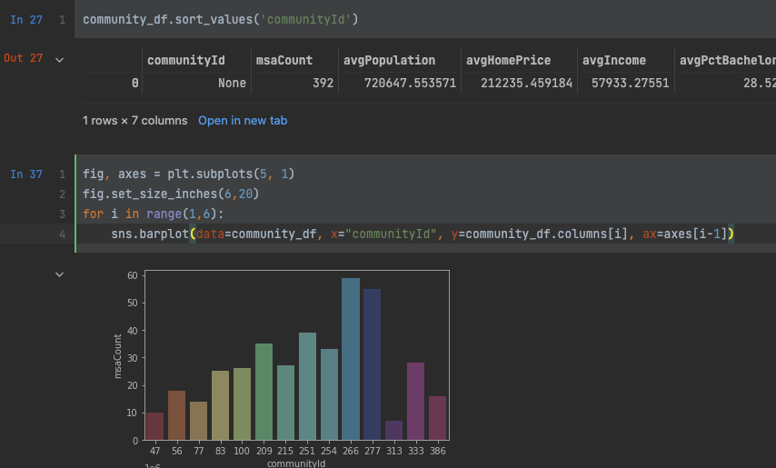

# GDS python libraries

## Install Libraries
If they don't exist already in your python environment

    pip install graphdatascience
    pip install seaborn

## Run workbook

You will see output that includes:

